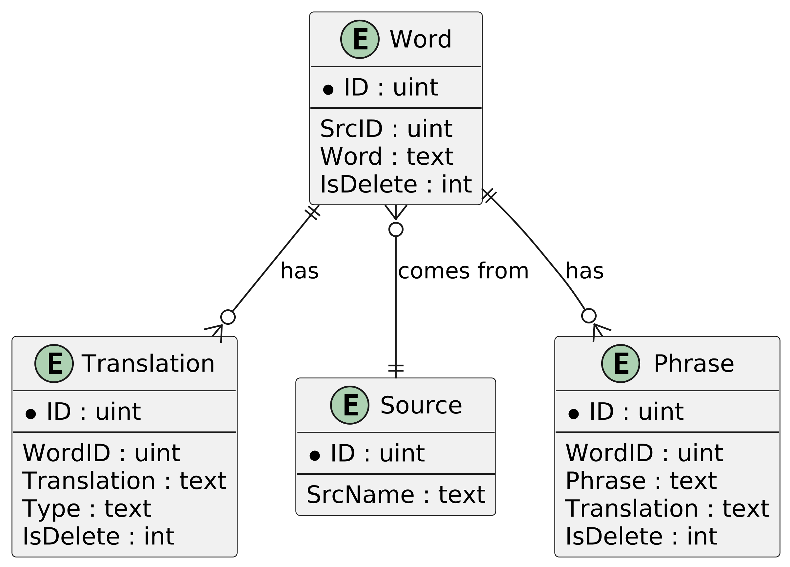

## 如何运行

```bash
go run main.go
```

## 目标

设计一个可维护、可扩展、高性能的数据导入方案，将结构化 JSON 数据高效存储到 SQLite 数据库中，为后续词汇学习系统提供数据储备。

## 数据解析

沿用行业推荐做法，选择`easyjson` 而非 `encoding/json`，因为标准库性能较差，频繁反射；`easyjson` 可生成零反射、预编译的代码，解析效率提升
5–10 倍。

## 字段拆分

JSON 中一个词条可能包含多个翻译与短语，需要对 JSON 数据进行抽象，而后解析为结构化的数据。

```go
type Phrase struct { // 短语
Phrase      string `json:"phrase"`
Translation string `json:"translation"`
}

type Definition struct { // 定义
Translation string `json:"translation"`
Type        string `json:"type"`
}

type VocItem struct { // 词汇
Word         string       `json:"word"`
Translations []Definition `json:"translations"`
Phrases      []Phrase     `json:"phrases"`
}

//easyjson:json
type VocItemList []VocItem // 词汇表
```

## 持久化存储

### 表结构及其预留设计

以构建“背单词 APP”的实际需求为背景，我们在数据建模过程中，虽然当前只处理静态 JSON 数据导入，但有意识地为未来功能扩展做了结构层级和字段维度的规划与取舍：

- 软删除设计， is_delete 字段作为软删除标记
- 词表管理，用户需要明确知道词汇从属的词表（如 CET4、CET6、托福、雅思等）。这不仅影响复习策略，也可能影响评分体系。因此我们引入
  Source 表，并通过 src_id 建立词条归属关系。
- 结构去冗余，将翻译（Translation）和短语（Phrase）拆分为独立表，使得任何对释义、短语的修改都可以精确定位且影响范围最小
- 词性表示法在不同语料中不一致（如 adj / a / 形容词 /
  adjective），易导致前端展示混乱、用户认知障碍。考虑到后期可建立词性映射表（Type → CanonicalType）。



- 所有结构具备软删除字段（is_delete）及来源字段（src_id）
- Word 一对多 Translation、Phrase，Word 多对一 Source

### 性能优化

为了保留了良好的工程结构，我们采用 GORM 框架进行数据库操作，避免裸写 SQL。

参考[link1](https://www.reddit.com/r/golang/comments/16xswxd/concurrency_when_writing_data_into_sqlite/?rdt=55626), [link2](https://phiresky.github.io/blog/2020/sqlite-performance-tuning/)
，SQLite 是轻量内嵌数据库，写入吞吐瓶颈主要在磁盘 IO 和写锁，因此优化重心集中在：

| 技术选择              | 原因                         |
|-------------------|----------------------------|
| **单线程顺序写**        | SQLite 单写锁机制，并发写无法提升效率     |
| **分批插入**          | 减少 SQL 构造和 ORM 反射次数，提升写入性能 |
| **关闭 GORM 默认事务**  | 避免 GORM 为每条记录包事务的性能浪费      |
| **禁用Verbose日志输出** | 禁止日志 IO 干扰主流程              |
| **启用 WAL 模式**     | 提升并发读性能，减少写锁等待             |

我们做如下优化：

| 点           | 原始实现        | 当前优化实现                                | 性能影响           |
|-------------|-------------|---------------------------------------|----------------|
| GORM 事务控制   | 每条默认事务      | `SkipDefaultTransaction: true` + 手动事务 | 减少事务开销         |
| 插入方式        | 每条 Create   | 批量 `Create([]T)`                      | 显著减少 ORM 调用成本  |
| 日志级别        | 默认 INFO     | `logger.Silent`                       | 禁止控制台 IO 干扰    |
| 写入事务策略      | 隐式单条写事务     | 单事务包批 + 分页                            | 写入速度提升数量级      |
| 批处理大小       | 无           | `batchSize = 750`                     | 平衡内存占用与 SQL 性能 |
| SQLite 参数调优 | 默认 `NORMAL` | `synchronous=OFF` + `WAL`             | 大幅降低写磁盘阻塞      |
| 多源支持        | 无           | `Source{SrcName}`                     | 支持分来源分析、删除、更新  |

### 工程结构与模块化设计

| 函数                    | 职责描述                               |
|-----------------------|------------------------------------|
| `initDB()`            | 初始化 SQLite 连接与性能参数                 |
| `autoMigrate()`       | 自动建表                               |
| `processSingleFile()` | 解析文件、插入 source、调用写入函数              |
| `insertBatch()`       | 按分页写入 Word、Translation、Phrase，事务控制 |

### 实测数据

我们在本地测试了两种插入方式：

| 版本     | 均写入耗时                   |
|--------|-------------------------|
| 串行单条插入 | **30** 秒（CET6）          |
| 优化事务插入 | **500** 毫秒（CET4 + CET6） |
